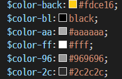
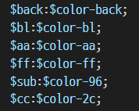
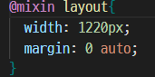

### sass 활용하기

# VANS 홈페이지 SASS 적용하여 만들어보기

## 프로젝트 목적 및 용도
- css는 규모가 커지면 가독성이 떨어지고 유지보수의 어려움이 있기때문에 코드의 재활용성과 가독성을 올려 css의 단점을 보완하고, 개발의 효율을 올릴수 있는 sass를 사용해보고자 하였습니다. 이의 개념을 이해하고 활용하여 사이트를 만들어보았습니다.
- 먼저 정확한 비교를 위해 css를 이용하여 완성한 후 sass로 다시 만들어 보았습니다.
---
## 프로젝트 시작하기 및 설치
- 터미널의 npm run dev를 이용하여 시작할수있습니다.
- parcel-bundler 1.12.5 버전을 설치하였습니다.
- sass 1.57.1 버전을 설치하였습니다.
---
### 기능설명
1. 변수의 사용 : 
    variable을 사용해서 css속성값을 통일하여 관리할수 있습니다.
      - 자주 사용하는 색의 보다 빠르고 편한 사용을 위하여 변수를 지정하였습니다.

      

      - 이후 더 간단한 사용을 위해 한번더 변수 지정을 진행하였습니다.

      
2. Import : 필요한 부분을 빠르고 간단하게 가져올수있습니다.
    - @use를 사용하여 변수를 편리하게 사용하였습니다
    - @import를 사용하여 mixin파일을 불러오고 이를  @include를 통하여 코드에 사용하였습니다.
3. Mixin : 
      - 상속되는 선택자를 계층적으로 명시하여 불필요한 반복적 사용을 줄일 수 있습니다.
      - @mixin 지시자를 이용하여 적용시에는 @include를 사용합니다. 반복해서 들어가는 고정값 width와 margin을 넣어서 사용하였습니다.

        
      

